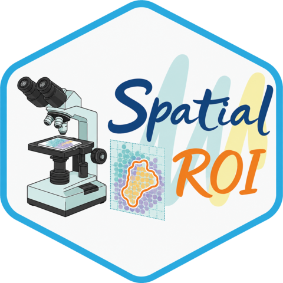

# SpatialROI 

SpatialROI is designed to facilitate the ROI-specific exploration, visualization, and analysis of spatial transcriptomics data.

**SpatialROI** is an interactive R package with a browser-based interface that enables spatial visualization and analysis directly from processed Seurat objects. Users can interactively select regions of interest (ROI), visualize gene expression patterns, and perform downstream analyses such as cell-type signature scoring, clustering, and differential expression analysis. In addition to the GUI, SpatialROI also provides a set of modular functions for scripted workflows, enabling customized analyses. Usage examples for these functions are provided in the [Function Workflow Vignette](vignettes_functions.Rmd).

SpatialROI can be accessed via a public demo hosted by the University of Pittsburgh: [https://shiny.crc.pitt.edu/spatial_api/](https://shiny.crc.pitt.edu/spatial_api/).

**Hosted-use note:** The public instance is intended for demonstration. Uploaded
objects are isolated to the current Shiny session and released when that session
ends; they are not intentionally retained for later users. For unpublished,
patient-derived, large, or multi-section data, use a local installation.

---

## Installation

```r
# Bioconductor packages (Seurat, GSVA)
if (!requireNamespace("BiocManager", quietly = TRUE)) install.packages("BiocManager")
BiocManager::install(c("Seurat", "GSVA"))

# SpatialROI, plus spacexr (pinned commit) and presto — resolved automatically
devtools::install_github("myaol/SpatialROI", dependencies = TRUE)
```

`dependencies = TRUE` is what pulls `spacexr` and `presto`; both are optional
extras declared in `Suggests`, and the exact spacexr commit that RCTD is
validated against is pinned in `DESCRIPTION`. Without them the app still runs —
cell-type deconvolution and the faster Wilcoxon test are simply unavailable.

---

## Launching the App

### With Example Data

```r
library(SpatialROI)
run_spatial_selector("demo")
```

### With Your Own Data

```r
library(SpatialROI)
Seurat_object <- readRDS("path/to/your_seurat.rds")
# Update the object to current Seurat version
Seurat_object <- UpdateSeuratObject(Seurat_object)
run_spatial_selector(Seurat_object, sample_name = "MyExperiment", show_image = TRUE)
```

Or upload through the app interface in the Visualization section using the 📤 **Upload Data** panel.

**Requirements:** Seurat object with spatial coordinates, raw or normalized expression data, and H&E image.

### Supported input and size

- SpatialROI is designed and tested for **10x Genomics Visium**. A Seurat object
  must retain a Visium spatial image and tissue coordinates. Raw input must be a
  SpaceRanger output bundle containing the filtered feature-barcode matrix and
  `spatial/` files.
- Xenium, CosMx, MERSCOPE, Slide-seq, and Visium HD bin objects are not currently
  validated by the interactive workflow merely because they can be represented in
  Seurat.
- The local Shiny request limit is **500 MB**. A hosted reverse proxy may impose a
  lower limit and return HTTP 413 before the request reaches SpatialROI. Use local
  analysis for large objects.
- RDS files expand in memory. The 22-MB example requires approximately 300 MB after
  loading; memory requirements increase with spots, assays, and image size.

### Bundled example dataset

The example is one human colorectal cancer 10x Visium tissue section from
Valdeolivas et al. (2024), with **17,529 genes and 1,253 tissue spots**, an H&E
image, SCT-normalized expression, and precomputed broad-cell-type proportions.
The associated publication is [*npj Precision Oncology* 8, 7
(2024)](https://doi.org/10.1038/s41698-023-00488-4).

---

## ROI Selection Tool

### Quick Spot Selection with `draw_ROI()`

If you only need to select spots from a region of interest without launching the full analysis app:

```r
library(SpatialROI)

# Load your Seurat object
Seurat_object <- readRDS("path/to/your_seurat.rds")

# Launch interactive ROI selector
selected_spots <- draw_ROI(Seurat_object, sample_name = "MyExperiment")

# The function returns a vector of spot IDs
print(selected_spots)
length(selected_spots)

# Use the selected spots for downstream analysis
subset_data <- subset(Seurat_object, cells = selected_spots)
```

This function supports multiple ROI selections and returns a vector of spot IDs, ideal for custom downstream workflows.

---

## Features

- 🗺️ **ROI Drawing** - Freehand drawing tools to select custom regions of interest
- 🧬 **Gene Set and Pathway Visualization** - Spatially map custom gene lists, cell-type signatures, or pathway gene sets
- 🔗 **Ligand-Receptor Colocalization** - ROI-specific, Gaussian-smoothed ligand-receptor score analysis
- 🧩 **Cell Type Deconvolution** - RCTD-based cell type deconvolution within user-defined ROIs
- 📊 **Spot Clustering** - Identify spatial domains using graph-based clustering methods
- 📈 **DEG Analysis** - Find differentially expressed genes between selected groups or clusters
- ⚖️ **Feature Comparison** - Statistical comparison plots with parametric/non-parametric tests
- 💾 **Data Export** - Download spot IDs, DEG results, and Seurat subsets
- 🖼️ **Figure Export** - Download UMAP, volcano, Moran, violin, and heatmap figures as PDFs

---

## Reference Datasets

Curated RCTD reference datasets for LUAD/LUSC, RCC, breast cancer, HCC, OSCC, and mouse brain are hosted on Zenodo:

DOI: https://doi.org/10.5281/zenodo.20554051

These datasets can be downloaded separately and supplied to SpatialROI for RCTD-based cell-type deconvolution.
Uploaded Seurat references must contain original RNA counts and cell-type labels
in active identities or a metadata column; retained cell types require at least
25 cells. Spatial objects used to rerun RCTD must contain an original `Spatial`
or `RNA` raw-count assay.

---

## Documentation

📚 **Detailed tutorials and examples:**
- [User Guide Vignette](vignettes.Rmd) - GUI Step-by-step walkthrough
- [Function Workflow Vignette](vignettes_functions.Rmd) - Scripted workflow
- [Manuscript](https://academic.oup.com/bioinformaticsadvances) - Lu et al. 2026, *Bioinformatics Advances* (in submission)

Static statistical plots are exported as publication-ready PDFs.

Deployment owners can use [`deployment/README.md`](deployment/README.md) and the
read-only verification script to reproduce the validated `spacexr` API and check
the packaged example, reference, and Hallmark resources.


---

## Getting Help

If you encounter bugs or have suggestions for improvements:
- **Report issues:** [GitHub Issues](https://github.com/myaol/SpatialROI/issues)
- **Contact authors:**
  - Mengyao Lu: [mel373@pitt.edu](mailto:mel373@pitt.edu)
  - Aodong Qiu: [qiuaodon@pitt.edu](mailto:qiuaodon@pitt.edu)
  - Lujia Chen: [luc17@pitt.edu](mailto:luc17@pitt.edu)

When reporting issues, please include your sessionInfo(), a minimal reproducible example, and any error messages.

---

## Citation

If you use SpatialROI in your research, please cite:

```bibtex
@article{SpatialROI2026,
  title = {SpatialROI: An Interactive R Shiny Package for Manual Region-Based Analysis of Spatial Transcriptomics Data},
  author = {Lu, Mengyao and Qiu, Aodong and Lu, Xinghua and Xu, Min and Chen, Lujia},
  journal = {Bioinformatics Advances},
  year = {2026},
  note = {manuscript in submission},
  url = {https://github.com/myaol/SpatialROI}
}
```

---

## Disclaimer

SpatialROI is designed to facilitate intuitive visualization, region selection, and exploratory analysis of spatial transcriptomics data. The tool provides convenient interfaces for clustering, differential expression, and feature comparison, but these analyses are intended for exploratory purposes only. Users should validate any biological interpretations using appropriate statistical or experimental methods.

---

## Acknowledgments

This work is supported by NIH grants including NHGRI R01HG014023, NLM 4R00LM013089, 5R01LM012011, and by U.S. NIH grants R35GM158094 and R01GM134020, as well as NSF grants DBI-2238093, DBI-2422619, IIS-2211597, and MCB-2205148. We also gratefully acknowledge the support and computational resources provided by the University of Pittsburgh Center for Research Computing and Data (CRCD), which enabled hosting the development of the SpatialROI application.

---

## License

This project is licensed under the MIT License - see the [LICENSE](LICENSE) file for details.
