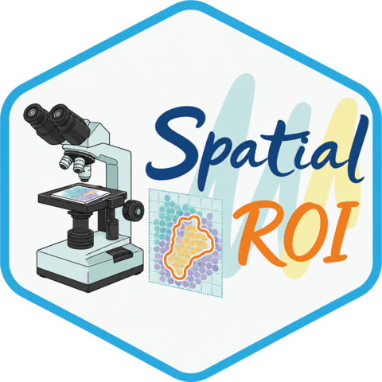

# SpatialROI 

SpatialROI is designed to facilitate the ROI-specific exploration, visualization, and analysis of spatial transcriptomics data.

**SpatialROI** is an interactive R package with a browser-based interface that enables spatial visualization and analysis directly from processed Seurat objects or Space Ranger output. Users can interactively select regions of interest (ROIs), visualize gene expression patterns, and perform downstream analyses such as cell-type signature scoring, clustering, and differential expression analysis.

SpatialROI can be accessed via a public demo hosted by the University of Pittsburgh: [https://shiny.crc.pitt.edu/spatial_api/](https://shiny.crc.pitt.edu/spatial_api/).

**Hosted-use note:** The public instance is intended for demonstration. For
unpublished, patient-derived, large, or multi-section data, use a local installation.

---

## Installation

```r
# Bioconductor packages (Seurat, GSVA)
if (!requireNamespace("BiocManager", quietly = TRUE)) install.packages("BiocManager")
BiocManager::install(c("Seurat", "GSVA"))

# Installs SpatialROI along with optional dependencies (spacexr, presto)
devtools::install_github("myaol/SpatialROI", dependencies = TRUE)
```

---

## Launching the App

### With Example Data

```r
library(SpatialROI)
run_spatial_selector("demo")
```

### With Your Own Data

```r
library(SpatialROI)
Seurat_object <- readRDS("path/to/your_seurat.rds")
# Only needed if the object was saved with an older Seurat version
Seurat_object <- UpdateSeuratObject(Seurat_object)
run_spatial_selector(Seurat_object, sample_name = "MyExperiment", show_image = TRUE)
```

Data can also be loaded inside the app, as described below.

### Supported input

SpatialROI is designed and tested for standard **10x Genomics Visium** data. In the
app, load data from the **Visualization** panel, under **Data Source**:

- **10x Visium Seurat object (.rds)**: a processed object with a Visium spatial
  image, tissue spot coordinates and log-normalized expression.
- **10x Visium Space Ranger output (.zip)**: the Space Ranger output folder (filtered
  feature-barcode `.h5` plus the `spatial/` folder, with no `.gz` files), compressed as one
  `.zip`. Spots are quality-filtered and log-normalized on load.

**Data compatibility.** Seurat can represent data from many spatial technologies,
but representation in a Seurat object does not imply compatibility with SpatialROI:
imaging-based platforms (Xenium, CosMx, MERSCOPE), Slide-seq, and Visium HD bin
structures have different data structures and are not validated here. The app
shows a warning when the uploaded data do not look like standard Visium (an
imaging-based image type, or far more spots than a Visium section), and the
results should then be interpreted with caution.

### Upload size and memory

- Uploads are limited to **150 MB on the public server** and **500 MB in a local
  installation** by default (adjustable, see [Upload limits](#upload-limits)).
  Use a local installation for large objects.
- RDS files expand in memory. The 32-MB example requires approximately 430 MB after
  loading; memory requirements increase with spots, assays, and image size.

### Bundled example datasets

Three example datasets ship with SpatialROI and load from the interface without any
upload:

- **Default Data (CRC)**: a human colorectal cancer 10x Visium section with
  17,529 genes and 1,253 tissue spots, an H&E image, SCT-normalized expression and
  precomputed broad cell-type proportions. Data:
  [Zenodo](https://doi.org/10.5281/zenodo.7551712). Valdeolivas A *et al.*
  Profiling the heterogeneity of colorectal cancer consensus molecular subtypes
  using spatial transcriptomics. *npj Precis Oncol* 2024;8:10.
  https://doi.org/10.1038/s41698-023-00488-4
- **Case Study 1 (CRLM)**: a colorectal cancer liver metastasis section with 3,721
  spots, provided as a preprocessed Seurat object. Data: NODE [OEP001756](https://www.biosino.org/node/project/detail/OEP001756). Wu Y
  *et al.* Spatiotemporal immune landscape of colorectal cancer liver metastasis
  at single-cell level. *Cancer Discov* 2022;12(1):134–53.
  https://doi.org/10.1158/2159-8290.CD-21-0316
- **Case Study 2 (OSCC)**: an oral squamous cell carcinoma section, provided as raw
  Space Ranger output. Data: GEO GSE208253. Arora R *et al.* Spatial
  transcriptomics reveals distinct and conserved tumor core and edge architectures
  that predict survival and targeted therapy response. *Nat Commun*
  2023;14:5029. https://doi.org/10.1038/s41467-023-40271-4

---

## Features

- 🗺️ **ROI Drawing** - Freehand drawing tools to select custom regions of interest
- 🧬 **Gene Set and Pathway Visualization** - Spatially map custom gene lists, cell-type signatures, or pathway gene sets
- 🔗 **Ligand–Receptor Colocalization** - ROI-specific, Gaussian-smoothed ligand–receptor score analysis
- 🧩 **Cell-Type Deconvolution** - RCTD-based cell-type deconvolution within user-defined ROIs
- 📊 **Spot Clustering** - Identify spatial domains with Louvain clustering
- 📈 **DEG Analysis** - Find differentially expressed genes between ROIs or groups, or between a region and the rest of the tissue
- ⚖️ **Feature Comparison** - Compare genes, scores or regions with statistical tests and violin plots
- 🧩 **Multi-Sample Comparison** - Compare ROI-versus-rest DEG tables across sections or studies
- 💾 **Data Export** - Save and reload ROI spot indices, and download DEG results and Seurat subsets
- 🖼️ **Figure Export** - Download UMAP, volcano, Moran, violin, and heatmap figures as PDFs

---

## ROI Spot Indices for the Examples

The three bundled datasets are described in
[Bundled example datasets](#bundled-example-datasets).

### Reproducing Case Study 1

To follow Case Study 1 from the supplementary material step by step:

1. **Download the four ROI index files** below. They are kept in this repository
   under [`datasets/roi_indices/case_study1/`](datasets/roi_indices/case_study1/)
   and are not included in the installed package. Click a file name, then click
   **Download raw file** at the top right of the file view.
2. **Load the data.** In SpatialROI, load **Case Study 1 (CRLM)**, which is bundled
   with the app.
3. **Import the regions.** Import each file with **⬆ Load ROI index (.csv)** on the
   map. Each file keeps its region name, so the regions appear as ROI 1 to ROI 4, as
   in the manuscript.

| ROI index (click, then Download raw file) | spots |
|---|---|
| [`CaseStudy1_CRLM_ROI_1_spot_index.csv`](datasets/roi_indices/case_study1/CaseStudy1_CRLM_ROI_1_spot_index.csv) | 90 |
| [`CaseStudy1_CRLM_ROI_2_spot_index.csv`](datasets/roi_indices/case_study1/CaseStudy1_CRLM_ROI_2_spot_index.csv) | 62 |
| [`CaseStudy1_CRLM_ROI_3_spot_index.csv`](datasets/roi_indices/case_study1/CaseStudy1_CRLM_ROI_3_spot_index.csv) | 65 |
| [`CaseStudy1_CRLM_ROI_4_spot_index.csv`](datasets/roi_indices/case_study1/CaseStudy1_CRLM_ROI_4_spot_index.csv) | 59 |

### Reproducing the Multi-Sample example tables

The Multi-Sample panel ships three ROI-versus-rest differential-expression
tables. The exact spot barcodes behind each one are published here:

**[`datasets/roi_indices/`](datasets/roi_indices/)**

| ROI index | spots | dataset to load | regenerates |
|---|---|---|---|
| `CRC_TLS_41spots.csv` | 41 | Default Data (CRC) — bundled | `01_CRC_TLS_ROI_vs_rest.csv` |
| `CRLM_TLS_86spots.csv` | 86 | Case Study 1 (CRLM) — bundled | `03_CRLM_liver_TLS_ROI_vs_rest.csv` |
| `P2N_TLS_157spots.csv` | 157 | [`datasets/P2N_Liver.rds`](datasets/) | `02_P2N_liver_TLS_ROI_vs_rest.csv` |

To reproduce a table: load the dataset, import its index with **Load ROI index
(.csv)** on the map, then run that ROI versus Rest. `CRC_TLS_41spots.csv` is also
the 41-spot region used in the cross-tool output-concordance analysis.

Any `.csv` with a `spot_id` column imports, so regions defined in other software
can be loaded the same way; the region takes the file's name unless the file
carries a `roi` column.

### Upload limits

Uploads are limited to 150 MB on the public server and 500 MB by default in a
local installation. A Seurat object needs roughly three times its file size in
memory once loaded, so large sections are better analysed locally.

In a local installation the limit can be raised or lowered. Set
`shiny.maxRequestSize` (in bytes) in R before launching the app:

```r
options(shiny.maxRequestSize = 2 * 1024^3)   # 2 GB; e.g. 100 * 1024^2 for 100 MB
SpatialROI::run_SpatialROI()
```

The same setting applies when launching with `run_spatial_selector()`. The
150 MB limit on the public server is set by the server and cannot be changed.

## Reference Datasets

Two RCTD references are built into SpatialROI and can be selected in the deconvolution
panel: colorectal cancer (CRC, from GSE132465) and colorectal cancer liver metastasis
(CRLM, from GSE225857). Curated references for lung adenocarcinoma, lung squamous cell
carcinoma, renal cell carcinoma, breast cancer, hepatocellular carcinoma, oral squamous
cell carcinoma and mouse brain are hosted on Zenodo:

DOI: https://doi.org/10.5281/zenodo.22759947

These datasets can be downloaded separately and supplied to SpatialROI for RCTD-based cell-type deconvolution.
Uploaded Seurat references must contain original RNA counts and cell-type labels
in active identities or a metadata column; retained cell types require at least
25 cells. Spatial objects used to rerun RCTD must contain an original `Spatial`
or `RNA` raw-count assay.

---

## Documentation

📚 **Detailed tutorials and examples:**
- [Video tutorial](https://youtu.be/ob9SSeWMlqA) - 18-minute walkthrough of the app
- [User Guide Vignette](vignettes.Rmd) - GUI Step-by-step walkthrough
- [Function Workflow Vignette](vignettes_functions.Rmd) - Scripted workflow
- [Manuscript](https://academic.oup.com/bioinformaticsadvances) - Lu et al. 2026, *Bioinformatics Advances* (in submission)

Static statistical plots are exported as publication-ready PDFs.


---

## Limitations and Future Work

- **Platform scope.** SpatialROI currently supports 10x Genomics Visium.
  Extending support to additional spatial transcriptomics platforms, including
  Visium HD, Xenium, CosMx, MERSCOPE, and Slide-seq, is a potential direction
  for future development and would require platform-specific implementation and
  validation.
- **Single-section analysis.** Interactive ROI drawing and most downstream
  analyses are performed on one image-aligned tissue section at a time. The
  Multi-Sample module supports cross-section comparison using ROI-versus-rest
  DEG results without pooling raw expression matrices.
- **Cross-sample interpretation.** Multi-Sample comparisons are descriptive and
  may be influenced by batch effects, patient-level differences, tissue
  composition, and ROI annotation.
- **Statistical interpretation.** Spot-level statistical tests describe
  within-section differences and should not be interpreted as independent
  patient-level replication.
- **Large datasets.** Local use is recommended for large or unpublished
  datasets, particularly when server upload or memory limits may become
  restrictive.

---

## Getting Help

If you encounter bugs or have suggestions for improvements:
- **Report issues:** [GitHub Issues](https://github.com/myaol/SpatialROI/issues)
- **Contact authors:**
  - Mengyao Lu: [mel373@pitt.edu](mailto:mel373@pitt.edu)
  - Aodong Qiu: [qiuaodon@pitt.edu](mailto:qiuaodon@pitt.edu)
  - Lujia Chen: [luc17@pitt.edu](mailto:luc17@pitt.edu)

When reporting issues, please include your sessionInfo(), a minimal reproducible example, and any error messages.

---

## Citation

If you use SpatialROI in your research, please cite:

```bibtex
@article{SpatialROI2026,
  title = {SpatialROI: An Interactive R Shiny Platform for Customized Region-Aware Spatial Transcriptomics Analysis},
  author = {Lu, Mengyao and Qiu, Aodong and Xu, Min and Lu, Xinghua and Chen, Lujia},
  journal = {Bioinformatics Advances},
  year = {2026},
  note = {manuscript in submission},
  url = {https://github.com/myaol/SpatialROI}
}
```

---

## Disclaimer

SpatialROI is designed to facilitate intuitive visualization, region selection, and exploratory analysis of spatial transcriptomics data. The tool provides convenient interfaces for clustering, differential expression, and feature comparison, but these analyses are intended for exploratory purposes only. Users should validate any biological interpretations using appropriate statistical or experimental methods.

---

## Acknowledgments

This research was supported in part by the University of Pittsburgh Center for Research Computing and Data, RRID:SCR_022735, through the resources provided. Specifically, this work used the HTC cluster, which is supported by NIH award number S10OD028483.

This work was supported by NIH grants including NHGRI R01HG014023, NLM 4R00LM013089, 5R01LM012011, and by U.S. NIH grants R35GM158094 and R01GM134020, as well as NSF grants DBI-2238093, DBI-2422619, IIS-2211597, and MCB-2205148.

---

## License

This project is licensed under the MIT License - see the [LICENSE](LICENSE) file for details.
